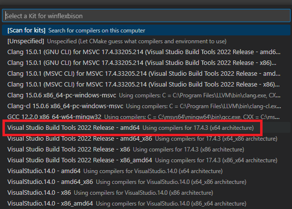
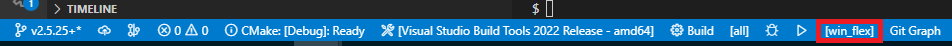
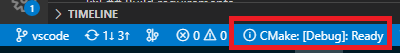

# WinFlexBison - Flex and Bison for Microsoft Windows

WinFlexBison is a Windows port of [Flex (the fast lexical analyser)](https://github.com/westes/flex/) and [GNU Bison (parser generator)](https://www.gnu.org/software/bison/).
Both win_flex and win_bison are based on upstream sources but depend on system libraries only.

**NOTE**:
* 2.4.x versions include GNU Bison version 2.7
* 2.5.x versions include GNU Bison version 3.x.x

## License
Flex uses a [BSD license](flex/src/COPYING), GNU Bison is [licensed under the GNU General Public License (GPLv3+)](bison/src/COPYING).
All build scripts in WinFlexBison are distributed under GPLv3+. See [COPYING](COPYING) for details.

All documentation, especially those under custom_build_rules/doc, is distributed under the GNU Free Documentation License (FDL 1.3+).

## Build status
Bison 3.x (master) [](https://ci.appveyor.com/project/lexxmark/winflexbison/branch/master) and, for compatibility reasons, Bison 2.7 (bison2.7) [](https://ci.appveyor.com/project/lexxmark/winflexbison/branch/bison2.7)

## Downloads
https://github.com/lexxmark/winflexbison/releases provides stable versions.
To test non-released development versions see the artifacts provided by CI under "Build status".

## Changelog
The release page includes the full Changelog but you may also see the [changelog.md](changelog.md) file.

## Build requirements
* Visual Studio 2017 or newer
* optional: CMake (when building with CMake), Ninja

## HowTo
You may use win_flex and win_bison directly on the command line or [use them via CustomBuildRules in VisualStudio](custom_build_rules/README.md).
### Visual Studio Code
Alternatively, VS Code is available for debugging, here is a simple guide (based on the [MS documentation](https://code.visualstudio.com/docs/cpp/cmake-linux)):
1. Make sure the [Prerequisites](https://code.visualstudio.com/docs/cpp/cmake-linux#_prerequisites) are installed.
2. [Select a compiler kit](https://code.visualstudio.com/docs/cpp/cmake-linux#_select-a-kit), any of the native `amd64` version of MSVC is recommended for compatibility - any of the rest with `x86` is cross-compiling a 32-bit version of `win_flex`/`win_bison`.



3. Due to `win_flex`/`win_bison` being separate executables/targets, debugging will need to [select a launch target](https://github.com/microsoft/vscode-cmake-tools/blob/main/docs/debug-launch.md#select-a-launch-target).



4. Optionally switch between build types - usually between `Release` or `Debug` builds, make sure `Debug` is selected when debugging or there will be no debug symbols to hit breakpoints.



5. Both `win_flex` and `win_bison` requires arguments for the target input/output source files, just add the arguments as how `win_flex` or `win_bison` was called from the command line where each space-separated argument is an element in [.vscode/launch.json](.vscode/launch.json)'s `args` array separated by commas, here is a sameple for `win_flex` target:
```
            "args": [
                "--header-file=sample.tab.h",
                "-osample.tab.c",
                "sample.l"
            ],
```

6. Setup the IDE for inspection [debugging](https://code.visualstudio.com/docs/editor/debugging), eg. breakpoints, logpoints.

7. Hit `F5` to start debugging.

## Example flex/bison files
See https://github.com/meyerd/flex-bison-example
