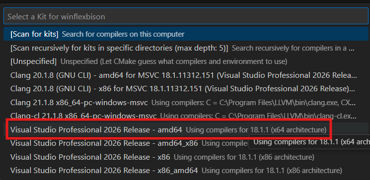
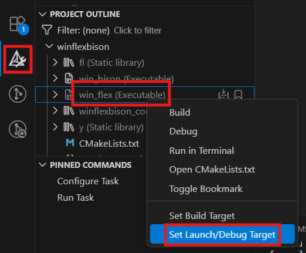
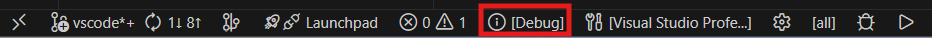
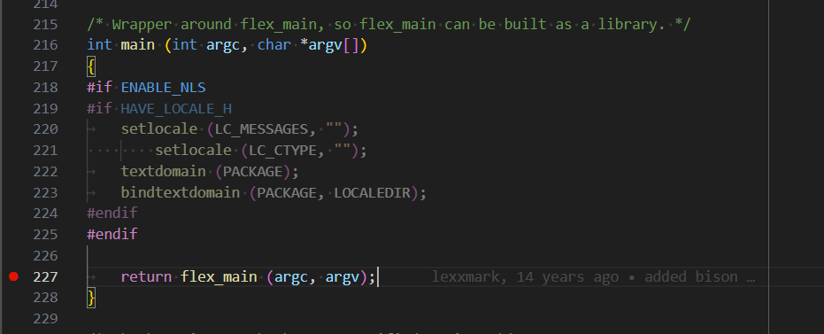
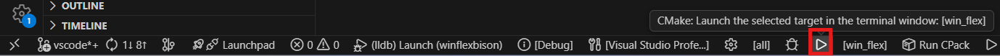
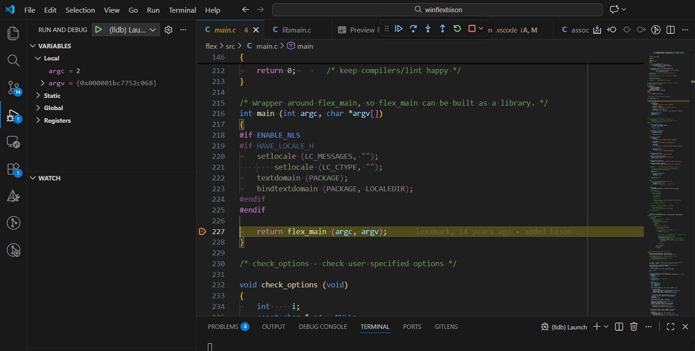

# How to setup vscode-like editors for debugging win_flex/win_bison

Here is a simple guide (based on the [MS documentation](https://code.visualstudio.com/docs/cpp/cmake-linux)):
1. Make sure the [Prerequisites](https://code.visualstudio.com/docs/cpp/cmake-linux#_prerequisites) are installed.
2. [Select a compiler kit](https://code.visualstudio.com/docs/cpp/cmake-linux#_select-a-kit), any of the native `amd64` version of MSVC is recommended for compatibility - any of the rest with `x86` is cross-compiling a 32-bit version of `win_flex`/`win_bison`.



NOTE: Click `Scan for kits` when setting up C/C++ debugging for the first time if there is no compiler kits found yet.

3. Due to `win_flex`/`win_bison` being separate executables/targets, debugging will need to [select a launch target](https://github.com/microsoft/vscode-cmake-tools/blob/main/docs/debug-launch.md#select-a-launch-target).



4. Optionally switch between build types - usually between `Release` or `Debug` builds, make sure `Debug` is selected when debugging or there will be no debug symbols to hit breakpoints.



5. Both `win_flex` and `win_bison` requires arguments for the target input/output source files, just add the arguments as how `win_flex` or `win_bison` was called from the command line where each space-separated argument is an element in [.vscode/launch.json](.vscode/launch.json)'s `args` array separated by commas, based on [flex-bison-example](https://github.com/meyerd/flex-bison-example),
  - here is a sample for `win_flex` target:
```json
            "args": [
                "calc.l",
            ],
```
  - here is a sample for `win_bison` target:
```json
            "args": [
                "-d",
                "calc.y",
            ],
```
  - NOTE: This example uses source files without full path was achieved by setting `cwd`
```json
            "cwd": "${workspaceFolder}/../flex-bison-example",
```

6. Setup the codebase for inspection [debugging](https://code.visualstudio.com/docs/editor/debugging), eg. breakpoints (with `F9`), [logpoints](https://github.com/vadimcn/codelldb/blob/master/MANUAL.md#logpoints).



7. Hit `F5` to start debugging, or click the `launch` button.



8. Here is how it looks like when the program pauses at a breakpoint, refer to the official [Debugging guide](https://code.visualstudio.com/docs/debugtest/debugging#_debugger-user-interface) for more information.

